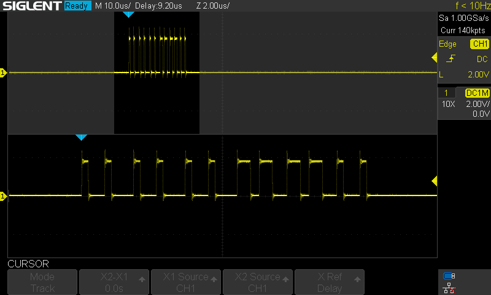

# Weird outputs

For some pins output is stuck to HIGH.

I can't explain it from software point of view. Because code
does not depend of pin (AVR GNU asm):
```
# Set pin LOW
and %[PortValue], %[PortAndMask]
st %a[PortAddress], %[PortValue]
```
(But it's duplicated for bit 0 and bit 1..)

(Pin values are just bits in bytes.) This sticking to HIGH occurs when
pin bit number is not 0. So on Uno it occurs for all pins except 0, 8
and A0.

Also it _does not_ occur when function is called with compile-time
constant _Pin_ value.


| What | Image |
:-----:|:------:
Normal | 
Weirdness 1 | 
Weirdness 2 | 
Weirdness 3 | 
