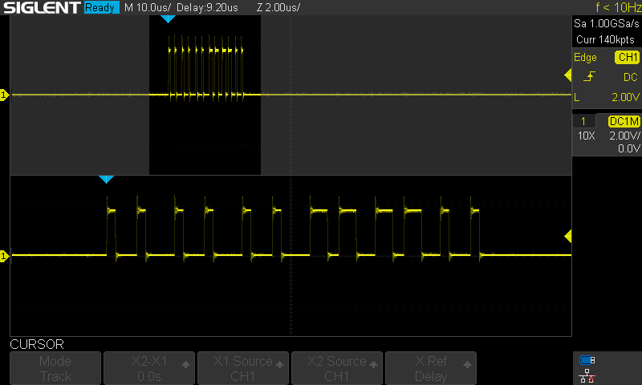

## Weird outputs

(2024-05)

There are some signal anomalies I cannot explain.

We're transferring bits by toggling pin.

Each bit is transferred in 1250 ns. First there is HIGH part, then LOW part.
If HIGH part is 900 ns -- bit is 1, if 350 ns -- bit is 0.

Still in some cases there is no LOW part for bit ones.

This may occur when

  1. Pin bit offset is not 0 (pin is not 0, 8 and A0)
  2. Pin number is not compile-time constant (we're setting pin
    number from serial data)

I have no explanation for this. Below is observed cases.

| What | Image |
:-----:|:------:
Normal | 
Weirdness 1 | 
Weirdness 2 | 
Weirdness 3 | 
